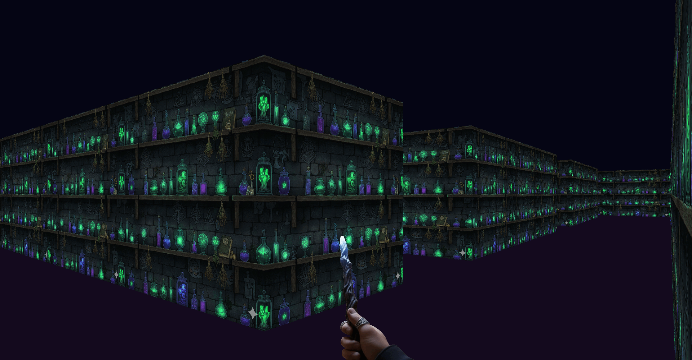
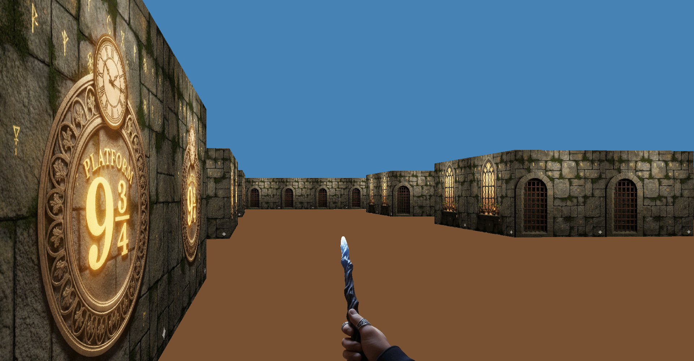
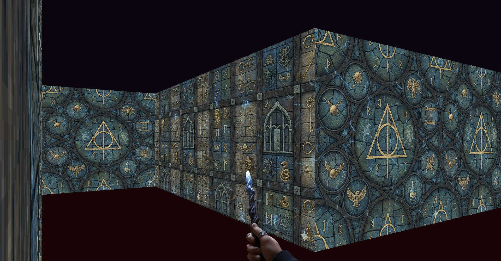

<div align="center">



# cub3D

**A raycasting 3D engine written in C — inspired by Wolfenstein 3D**

*42 School Project · akoaik & msafa*

[](https://en.wikipedia.org/wiki/C_(programming_language))
[]()
[](https://42.fr)

</div>

---

## What is cub3D?

cub3D is a first-person 3D engine built from scratch in C using the **raycasting** technique — the same method that powered Wolfenstein 3D (1992) and DOOM. From a simple 2D grid map, the engine projects a fully textured 3D world in real time.

No OpenGL. No game engine. Just math, pixels, and C.

---

## Features

| Feature | Details |
|---|---|
| Real-time 3D rendering | Smooth raycasting at consistent frame rates |
| Textured walls | Unique XPM textures per direction — N, S, E, W |
| Configurable colors | Custom RGB values for floor and ceiling |
| Player movement | Forward, backward, left/right strafe |
| Camera rotation | Smooth left/right rotation via arrow keys |
| Map parsing | Full `.cub` file parser with error handling |
| Multiple maps | Load any valid `.cub` configuration |

---

## How It Works

The core idea: for every vertical column of pixels on the screen, cast a ray from the player into the map and find the nearest wall. The closer the wall, the taller it appears.

### Camera & Field of View

```
                    camera plane
               ◄────────────────────►
               │                    │
   left ray  \ │    center ray      │ / right ray
              \│        |           │/
               \        ↓           /
                \  →→→ [P] →→→     /
                 \   direction     /
                  \               /
                   \_____ ______/
                         V
                       FOV ≈ 66°
```

### The Raycasting Pipeline

```
For each screen column (x = 0 to WIDTH):
  1. Compute ray direction based on player angle + camera plane offset
  2. Run DDA (Digital Differential Analyzer) to step through the grid
  3. Detect the first wall hit and record which side (N/S or E/W)
  4. Compute perpendicular distance → avoids fisheye distortion
  5. Calculate wall slice height on screen
  6. Sample the correct column from the wall texture
  7. Draw floor below and ceiling above
```

### DDA Algorithm

DDA is an efficient grid-traversal algorithm. Instead of checking every pixel, it jumps directly from one grid boundary to the next — making wall detection fast and accurate.

```
Ray steps through grid cells:

  ┌───┬───┬───┬───┐
  │   │   │ █ │   │
  ├───┼───┼───┼───┤
  │   │ · │·█ │   │   · = ray path
  ├───┼───┼───┼───┤   █ = wall hit
  │ P ·───┤   │   │   P = player
  ├───┼───┼───┼───┤
  │   │   │   │   │
  └───┴───┴───┴───┘
```

### Fisheye Correction

A naive distance calculation produces a fisheye distortion. cub3D corrects this by using the **perpendicular** distance (projected onto the camera plane), not the Euclidean distance from player to wall.

### Texture Mapping

Once the wall column height is known, the engine maps a vertical strip of the corresponding texture (N/S/E/W) to that column — scaled proportionally to simulate depth.

---

## Project Structure

```
cub3D/
├── main.c                      # Entry point
├── Makefile
│
├── includes/
│   ├── data.h                  # Structs, defines, prototypes
│   ├── libft.h
│   └── mlx.h
│
├── src/
│   ├── parsing/
│   │   ├── map_parsing.c       # .cub file parser
│   │   ├── map_dimensions.c    # Grid size computation
│   │   ├── textures_parsing.c  # Texture path extraction
│   │   └── colors_parsing.c    # RGB color parsing
│   │
│   ├── rendering/
│   │   ├── raycasting.c        # Main render loop
│   │   ├── dda.c               # DDA wall detection
│   │   ├── dda_setup.c         # Ray initialization
│   │   ├── drawing.c           # Pixel-level drawing
│   │   ├── camera_plane.c      # Camera setup
│   │   └── textures_images.c   # Texture loading
│   │
│   └── movements/
│       ├── player_movements.c  # WASD movement logic
│       ├── player_rotations.c  # Camera rotation
│       ├── control_movements.c # Key input handler
│       └── cleanup.c           # Memory/resource cleanup
│
├── maps/                       # .cub map files
├── textures/                   # .xpm wall textures
├── libft/                      # Custom C library
└── minilibx/                   # Graphics library
```

---

## Getting Started

### Build

```bash
make          # compile
make clean    # remove object files
make fclean   # remove objects + executable
make re       # full rebuild
```

### Run

```bash
./cub3d maps/<map_name>.cub
./cub3d maps/hogsmade_map.cub
```

### Controls

| Key | Action |
|---|---|
| `W` | Move forward |
| `S` | Move backward |
| `A` | Strafe left |
| `D` | Strafe right |
| `←` | Rotate left |
| `→` | Rotate right |
| `ESC` | Quit |

---

## Map Format (`.cub`)

### Textures
```
NO ./textures/north.xpm
SO ./textures/south.xpm
WE ./textures/west.xpm
EA ./textures/east.xpm
```

### Colors
```
F 220,100,0       # floor  (R,G,B)
C 135,206,235     # ceiling (R,G,B)
```

### Map Grid
```
11111111111
10000000001
1000N000001
10000000001
11111111111
```

| Symbol | Meaning |
|---|---|
| `1` | Wall |
| `0` | Walkable space |
| `N` `S` `E` `W` | Player spawn + facing direction |

### Validation Rules
- Map must be fully enclosed by walls
- Exactly one player spawn point
- No empty lines inside the map
- Spaces treated as void — must be enclosed by walls

---

## References

- [Lode's Raycasting Tutorial](https://lodev.org/cgtutor/raycasting.html) — the definitive guide to raycasting, DDA, texture mapping, and fisheye correction

---

## Screenshots

<div align="center">





</div>

---

## Authors

<div align="center">

| | Author | GitHub |
|---|---|---|
| | **akoaik** | [github.com/alikoaikk](https://github.com/alikoaikk) |
| | **msafa** | [github.com/mohamedsafa](https://github.com/mohamedsafa) |

*Built with curiosity and too many segfaults.*

</div>
